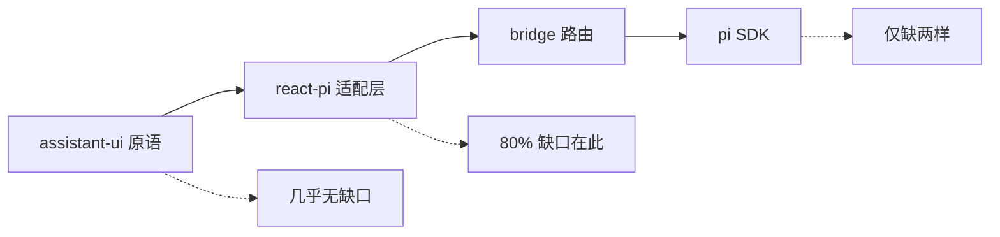

# pi-cockpit 能力对接地图

作者: ziye

> update_time: 2026-07-17 00:50 CST
> 本文是 pi-cockpit 对话能力对接的 SSOT:哪些已通、哪些可接、卡在哪层、按什么顺序推进。三路源码级调研(pi SDK / react-pi 适配层 / assistant-ui 原语)交叉产出,全部判定带源码行号证据。react-pi 已 vendor 进本 workspace(`packages/react-pi`,0.0.6-ziye.1),适配层从此是我们自己的代码。

## 分层判定

- **assistant-ui 0.14.26 UI 层**:edit / reload / branch-picker / suggestions / quote 等原语全部齐备,只等 runtime 支持。
- **pi SDK 层**(cockpit 走 in-process,比 RPC 契约更强):只缺物理删单条消息(session 文件 append-only by design)和 queue 单条操作。
- **react-pi 适配层**:80% 缺口所在;已 vendor,全部可改。

## 已接通基线(无需再动)

send-message(text+image)/ SSE 流式 / cancel / steer+followUp 入队 / tool-approval + host-UI 四类应答(confirm/select/input/editor)/ setModel + thinkingLevel / thread rename+archive+delete / extras 镜像(contextUsage / compaction / retry / lastError)。

## 能力地图(20 项)

### ready-to-wire:只动 web 层(6 项)

| 能力 | 现状 | 要做的事 |
|---|---|---|
| 静态 suggestions | 适配层其实透传(`Thread.tsx` 注释"0.0.6 不透传"是过期信息,vendored `usePiRuntime.ts:204` 已核实);现为自渲染变通 | PiRuntimeProvider 传 suggestions + 换 `ThreadPrimitive.Suggestions` |
| 朗读 + 点赞点踩 | 通道全在;**ziye 已明确决策不要此功能(2026-07-16 删除)** | 不做,仅记录可行性 |
| 输入增强(输入历史/实时补全/@提及) | `unstable_useComposerInputHistory` / `LiveCompletionAdapter` / `MentionAdapter` 均导出未用,纯前端 | Composer 挂 hook;注意 unstable_ 漂移风险 |
| quote / 选中引用回复 | `SelectionToolbarPrimitive` + `ComposerPrimitive.Quote` 全齐;quote 是否进 sendMessage 文本未实测 | Thread 挂 SelectionToolbar;若 quote 未入 prompt 再补 `buildPiSendInput` |
| 归档列表可见 | `listThreads` 支持 `includeArchived`,cockpit 没传,刷新后归档不可见 | 调用处传参;持久化是另一条(见下) |
| 多工作区 | supervisor 已按 threadId 多路复用 + per-call workspacePath;cockpit 固定进程 cwd | 传 workspacePath + 自绘切换器;顺修 `node/client.ts:57` models 忽略 workspacePath 瑕疵 |

### needs-adapter-work:改 vendored react-pi(12 项,从轻到重)

| # | 能力 | pi 侧 | 断点 | 工作量 |
|---|---|---|---|---|
| 1 | ~~session-stats 面板~~ | **已完成(2026-07-17 热身批)**:PiClient.getSessionStats 四层贯通,web SessionCost 显示会话累计成本 | - | - |
| 2 | ~~原生导出 html~~ | **已完成(2026-07-17 热身批)**:PiClient.exportHtml,/export 下载 pi 原生自包含 HTML(jsonl 未做,session 文件本身即 jsonl) | - | - |
| 3 | ~~手动 /compact~~ | **已完成(2026-07-17 热身批)**:PiClient.compact + /compact 命令;业务拒绝经 error 事件上屏 LastErrorBanner | - | - |
| 4 | 侧栏按最近活跃排序 | SessionInfo 含时间 | `mapThreadMetadata` 没映射 lastMessageAt | 字段映射 |
| 5 | ~~archive 持久化~~ | **已完成(2026-07-17 热身批)**:归档集落盘 `~/.pi/agent/cockpit-archive.json`,启动回读 | - | - |
| 6 | slash 面板接 pi 命令源 | RPC `get_commands`(extension+prompt+skills 三源) | PiClient 无 getCommands;现仅 3 个本地命令 | 单端点 + 面板合并 |
| 7 | AI 自动会话标题 | `set_session_name` 有;**pi 是否自动命名两份调研冲突,待核实** | `generateTitle` 是空流 stub | 先核实再定方案 |
| 8 | bash 执行(! 入口) | `executeBash(command,onChunk)` + abortBash | 历史可投影展示,无发起入口 | 端点 + SSE chunk + composer 拦截 |
| 9 | extension UI notify/custom | 双向协议完整 | notify 无 sink 被丢;custom() 直接 reject | supervisor 传 sink → toast |
| 10 | regenerate / reload | `navigateTree(targetId)` 回退重放 | external store 无 onReload;PiClient 无 navigateTree | navigateTree 地基四层联动 |
| 11 | 编辑历史消息重跑 | `navigateTree(targetId,{editorText})` 预填重发 | 无 onEdit;同上地基 | 地基之上 + EditComposer |
| 12 | branch-picker 会话树 | `get_tree` + fork/clone,树是 pi 一等公民 | **最大断链**:分支只投影成只读 data part | 最重:投影层维护分支 repository |

edit / reload / branch 三件共享同一块地基 **navigateTree**(pi SDK 有、RPC 没有、PiClient 契约没接),要动 PiClient + ThreadSupervisor + bridge 路由 + runtime 回调四层。建议先做 1-3 单端点小活热身打通四层套路,再按 reload → edit → branch 渐进点亮。

### needs-pi-work(1 项)

| 能力 | 说明 |
|---|---|
| queue 单条 promote/remove | pi 只有整体 clearQueue,上游即限;要动 fork ziye-pi 的 coding-agent 核心。变通(clear→过滤→重入队)有竞态风险 |

### not-feasible(1 项)

| 能力 | 说明 |
|---|---|
| 物理删除单条消息 | session JSONL append-only by design,全仓无 delete API。语义变通 = navigateTree 废弃分支(文件里仍在),若要做归入 branch 那批 |

## 修正与风险备忘

- `Thread.tsx` 起手建议处"react-pi 0.0.6 不透传 suggestions"注释是过期信息,接 suggestions 时一并修正。
- vendored react-pi 与上游断开,升级 assistant-ui 大版本时需人工对照上游 react-pi 变更。
- compact 只验证过业务拒绝路径(小会话);大会话真实压缩路径待首次实际使用验证。
- 消息操作条的导出 Markdown 已直出为下载按钮(2026-07-17,ziye 决策去掉溢出菜单)。
